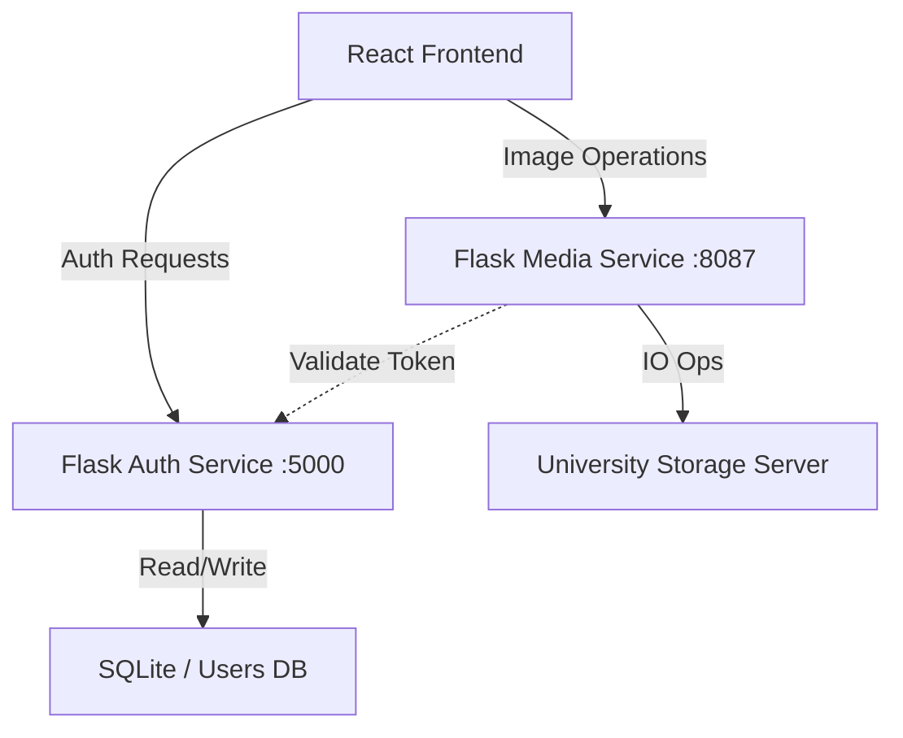

# Capturesque – University Photography Gallery Platform

> **Status**: Production-ready Prototype | **Users**: 2000+ Students (Projected) | **Role**: Full Stack Engineer

**Capturesque** is a centralized, high-performance photography gallery platform engineered for Shiv Nadar University. It creates a seamless digital ecosystem for the photography club to manage, secure, and distribute event coverage to the student body, replacing fragmented Google Drive links and WhatsApp groups.

---

## 🏗️ Project Overview

This project was built to solve a specific scalability and accessibility problem faced by university clubs: **Media Fragmentation**. As usage scales to thousands of students and terabytes of data, relying on ad-hoc sharing methods becomes inefficient and insecure. Capturesque provides a robust, role-based platform for media archival and discovery.

---

## 🚩 Problem Statement

1.  **Inefficient Retrieval**: Students spent considerable time searching through disparate Google Drive folders to find specific event coverage.
2.  **Lack of Centralization**: No single source of truth for university event history.
3.  **Security Gaps**: Drive links were often shared publicly without expiry or access logs.
4.  **No Discovery**: Photos were unsearchable; users had to manually scroll through thousands of thumbnails.

---

## 🎯 User Requirements & Stakeholders

-   **Student User (Viewer)**:
    -   Fast, responsive gallery view with infinite scroll/pagination.
    -   Ability to download high-resolution images.
    -   Advanced filtering by event date and category.
-   **Admin (Photographer)**:
    -   Bulk upload capability for hundreds of high-res images.
    -   Folder management (CRUD) directly mapped to event names.
    -   Role-based security to prevent unauthorized deletions.

---

## 📐 System Architecture

I designed Capturesque using a **Service-Oriented Architecture (SOA)** approach to decouple concerns and improve maintainability.

### High-Level Design


1.  **Frontend (Client)**: A React Single Page Application (SPA) optimized for client-side rendering.
2.  **Auth Service (Port 5000)**: Lightweight Flask service handling Identity Management (IAM), Registration, and JWT issuance.
3.  **Media Service (Port 8087)**: High-throughput Flask service dedicated to file I/O operations (Upload, Rename, Stream).
4.  **Data Strategy**:
    -   **Identity**: SQLite (for User accounts) - chosen for ACID compliance.
    -   **Assets**: **University Campus Server** - Leveraging on-premises high-availability storage for low-latency access within the campus intranet.

---

## ⚙️ Key Engineering Decisions

### 1. Decoupling Auth from Content
**Decision**: Split the backend into `auth.py` and `gallery.py` (serving on different ports).
**Trade-off**: Increases deployment complexity (managing two processes).
**Benefit**: Prevents heavy image processing or upload tasks from blocking authentication requests. Allows independent scaling of the Media Service (which is I/O bound) vs. the Auth Service (CPU/Network bound).

### 2. On-Premises Campus Storage vs. Cloud
**Decision**: Utilize the University's local servers for image storage instead of public cloud (S3).
**Trade-off**: Requires manual maintenance of hardware and backups.
**Benefit**: **Zero Egress Costs** (bandwidth) and extremely low latency for students connected to the campus Wi-Fi. This aligns with the data sovereignty policies of the institution.

### 3. JWT (JSON Web Tokens) for Authentication
**Decision**: Stateless authentication mechanism.
**Why**: Eliminates the need for server-side session storage (Redis/Memcached) for this scale, reducing infrastructure cost and complexity.

---

## 📊 Scalability, Reliability & Performance

-   **Frontend Optimization**: Implemented **Virtualization** (planned) and **Pagination** (Page Size: 50) to handle folders containing 1000+ images without DOM thrashing.
-   **Concurrent Uploads**: The upload widget uses a queue system to manage file uploads sequentially or in batches, preventing browser hang during multi-GB uploads.
-   **Error Handling**: Comprehensive try-catch blocks in the API ensure that a single corrupt file does not crash the server. 500/400 error codes are gracefully handled by the UI with Toast notifications.

---

## 🛠️ Tech Stack

### Core Engineering
-   **Frontend**: React.js (v18+), Vite (Build Tool), Axios (Network Interceptor pattern).
-   **Backend**: Python Flask (REST APIs), Flask-CORS, Flask-JWT-Extended.
-   **Security**: Bcrypt (Key Derivation), JWT (Access Tokens).
-   **Infrastructure**: Local Development / Campus VM Deployment.

### Data & I/O
-   **Database**: SQLite (SQLAlchemy ORM).
-   **Storage**: On-premise Network Attached Storage (NAS).

---

## 🚀 Setup & Local Development

### 1. Backend: Authentication Service
```bash
cd src
# Install dependencies
pip install flask flask_sqlalchemy flask_bcrypt flask_jwt_extended python-dotenv flask_cors

# Run Auth Service (Port 5000)
python auth.py
```

### 2. Backend: Gallery (Media) Service
```bash
# In a new terminal
cd src
# Run Media Service (Port 8087)
python test.py
```

### 3. Frontend
```bash
# In root directory
npm install
npm run dev
```

---

## 🧪 Testing & Validation

-   **Unit Testing**: Manual validation of API endpoints via Postman.
-   **Integration Testing**: Verified the "Upload -> Rename -> Delete" lifecycle to ensure file system consistency.
-   **Security Testing**: Validated `admin_required` decorators to prevent privilege escalation on sensitive endpoints.

---

## 🔮 Future Improvements

1.  **Authentication Migration**: Transition to **Clerk** for enterprise-grade identity management, MFA, and social logins.
2.  **Notification System**: Implement an event-driven email service (SMTP/SendGrid) to notify subscribed users immediately when photographers complete a batch upload.
3.  **Database Migration**: Move from filesystem traversal to **PostgreSQL** to enable complex queries (e.g., filtering photos by specific event tags or dates).
4.  **CI/CD**: Specific GitHub Actions to lint (ESLint/Flake8) and build on push.

---

## 💡 What I Learned
-   **System Design**: How to structure a full-stack app for maintainability (Service segregation).
-   **Security First**: The importance of sanitizing input paths (`secure_filename`) to prevent Directory Traversal attacks.
-   **React Lifecycle**: Managing state for complex UI interactions like multi-file uploads and floating progress widgets.
-   **REST Principles**: Designing clean, resource-oriented API URLs.

---

*This project represents my ability to identify a real-world problem, design a scalable solution, and implement it using modern engineering practices.*
