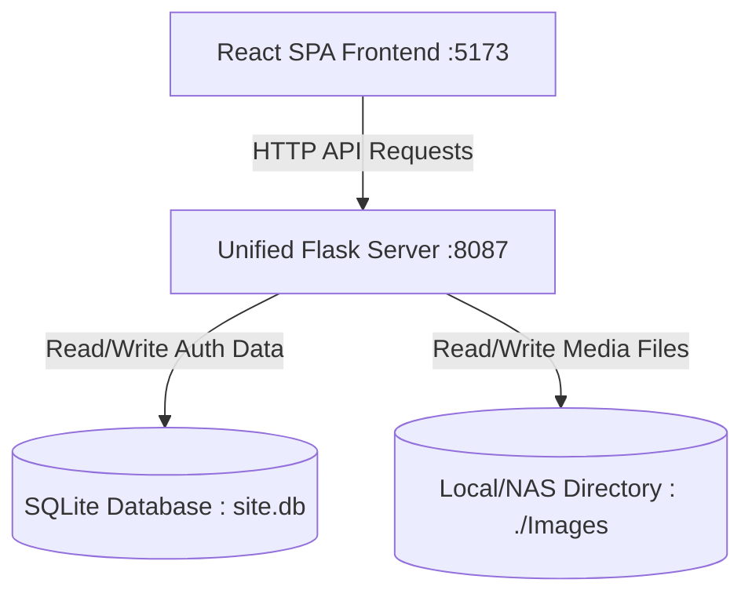

# Capturesque 📸
### University Photography Gallery Platform

[](https://vite.dev/)
[](https://react.dev/)
[](https://flask.palletsprojects.com/)
[](https://www.sqlite.org/)

**Capturesque** is a centralized, high-performance photography gallery platform designed and engineered for Shiv Nadar University. It provides a seamless, secure, and modern digital ecosystem for the university's photography club to organize, store, and distribute event coverage to the student body, successfully replacing fragmented Google Drive folders and messy WhatsApp groups.

---

## 🏗️ System Architecture

Capturesque is built using a decoupled Client-Server architecture. The frontend is a highly responsive Single Page Application (SPA), while the backend is a unified, resource-oriented Flask API handling both identity management and media transactions.


```mermaid
graph TD
    Client[React SPA Frontend :5173] -->|HTTP API Requests| Backend[Unified Flask Server :8087]
    Backend -->|Read/Write Auth Data| DB[(SQLite Database : site.db)]
    Backend -->|Read/Write Media Files| Storage[(Local/NAS Directory : ./Images)]
```

1. **Frontend (Client)**: Built with React 19 and Vite. Optimized for fast rendering, lazy image loading, and smooth interactions.
2. **Unified API Backend (Port 8087)**: A Flask server handling authentication (registration, secure login, password resets) and media operations (chunked uploads, file management, metadata association).
3. **Data Layer**:
   * **Identity & Club Info**: Managed via SQLite using SQLAlchemy ORM (with auto-migrating database schemas).
   * **Assets**: Managed directly on-premises via local disk/Network Attached Storage (NAS) under the `./Images` directory, eliminating public cloud egress fees.

---

## ✨ Features & User Experience

### 👥 Student Viewer
* **Intuitive Gallery Navigation:** Browse photos by event folders with breadcrumb tracking.
* **Dual View Layout:** Seamlessly switch between a visual **Grid View** and a detailed **List View**.
* **High-Resolution Downloads:** Download individual images directly or select multiple photos to download as a compiled `.zip` file.
* **Responsive Styling:** Sleek dark-mode aesthetic with custom animations, custom scrollbars, and modern typography.

### 📸 Photographer / Admin
* **Sequential Chunked Uploads:** Upload large image and video files (supporting GB-sized files) smoothly. The custom `UploadProgressWidget` tracks live chunk percentages, retry states, and queue statuses.
* **Dynamic Folder Management:** Create, rename, and delete folders directly from the dashboard interface.
* **Admin Dashboard:** Access control panel to manage user privileges (granting/revoking photographer permissions) and audit logs.
* **Activity Logs:** Audit trail tracking all key photographer operations (uploads, renaming, deletions) with timestamps.
* **Hero & Featured Assignments:** Set specific gallery photos as home page hero sliders or categorize them under featured sections from within the viewer modal.

---

## 🔒 Security Measures

* **Stateless Authorization:** Secure JSON Web Tokens (JWT) manage credentials. Tokens are automatically attached to outgoing client headers.
* **Role-Based Access Control (RBAC):** Custom Flask API decorators (`@admin_required`, `@photographer_or_admin_required`) prevent privilege escalation.
* **Password Hashing:** Implements salted `bcrypt` key derivation for credentials and security answers.
* **Input Sanitization:** Uses `secure_filename` and strict directory bounding path-validation (`safe_join_base`) to eliminate **Directory Traversal** vulnerabilities.
* **Account Locking:** Enforces account lockouts (5-minute cooldown) after 5 consecutive failed login attempts to safeguard against brute-force attacks.

---

## 🛠️ Tech Stack

| Layer | Technologies |
| :--- | :--- |
| **Frontend** | React 19, Vite, Axios, React Icons, React Router DOM |
| **Backend** | Python 3, Flask, Flask-CORS, Flask-JWT-Extended, Flask-Bcrypt |
| **Database** | SQLite, SQLAlchemy ORM |
| **Styling** | Vanilla CSS (Harmonious Dark Theme, responsive layouts, micro-animations) |

---

## 🚀 Setup & Local Development

### Prerequisites
* Python 3.10+ installed
* Node.js 18+ installed

### 1. Backend Server Setup
1. Navigate to the root of the project directory where the `requirements.txt` file is located:
   ```bash
   pip install -r requirements.txt
   ```
2. Navigate to the `my-react-app` directory and create a `.env` file (or duplicate `.env` to configure settings):
   ```env
   DATABASE_URL=sqlite:///site.db
   JWT_SECRET_KEY=your_super_secret_jwt_key
   VITE_API_BASE_URL=http://localhost:8087
   VITE_AUTH_BASE_URL=http://localhost:8087
   IMAGES_PATH=./Images
   ```
3. Run the unified backend server:
   ```bash
   python src/server.py
   ```
   *The server will initialize on `http://localhost:8087` and auto-seed default folders, schema models, and the primary admin account.*

### 2. Frontend Development Server Setup
1. Open a new terminal in the `my-react-app` directory.
2. Install local npm dependencies:
   ```bash
   npm install
   ```
3. Launch the hot-reloading development server:
   ```bash
   npm run dev
   ```
4. Access the application in your browser at `http://localhost:5173`.

---

## 🔑 Seeding & Default Credentials

On initial database boot, the backend automatically seeds a primary administrator account alongside sample photography club members:
* **Admin Email:** `dharani080905@gmail.com` *(Default config, can be overridden via `ADMIN_EMAIL` env variable)*
* **Admin Password:** `Admin@123`
* **Security Answer (Color):** `blue`

---

## 🔮 Future Roadmap

1. **Authentication Migration:** Transitioning to **Clerk** authentication for enterprise-grade social SSO and Multi-Factor Authentication.
2. **Notification Subscriptions:** Event-driven email service (SMTP/SendGrid) notifying subscribed students when event photos are published.
3. **Database Migration:** Upgrading to a PostgreSQL database on production to support complex tagging and search filtering.
4. **CI/CD Integration:** Automated GitHub Actions pipeline for linting, security audits, and continuous cloud deployments.
