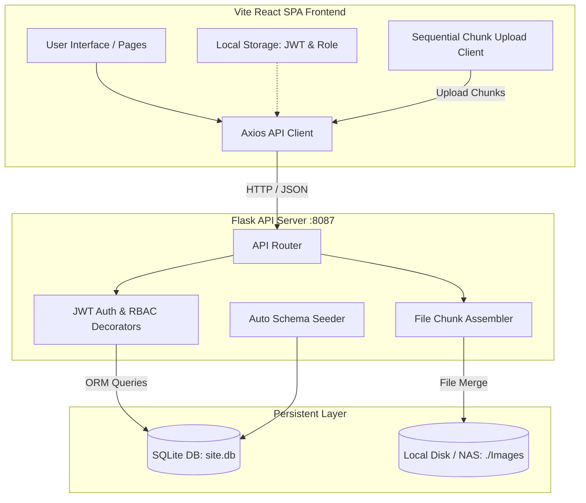
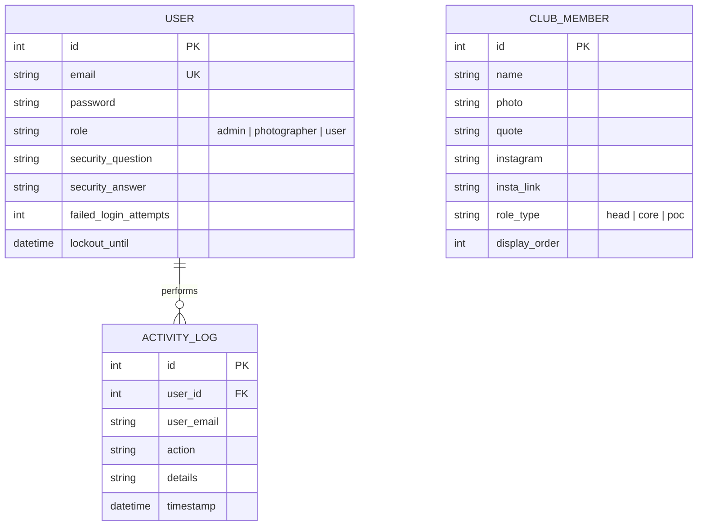
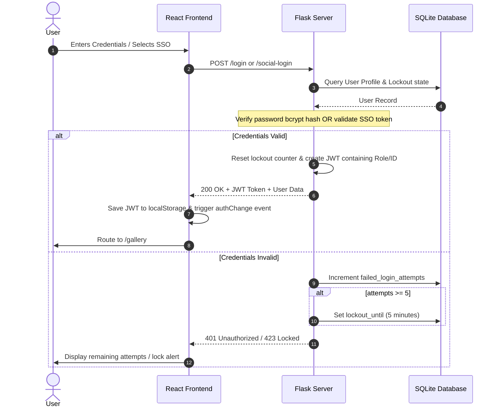
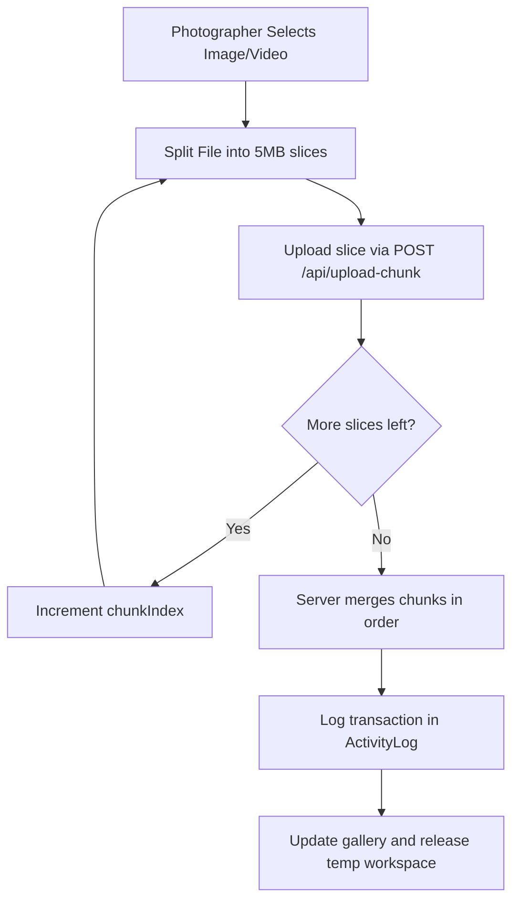

# Capturesque 📸
### Shiv Nadar University Photography Gallery Platform

[](https://vite.dev/)
[](https://react.dev/)
[](https://flask.palletsprojects.com/)
[](https://www.sqlite.org/)
[](LICENSE)
[]()
[]()

**Capturesque** is a centralized, high-performance, and secure photography gallery and contest management platform custom-engineered for Shiv Nadar University. It provides a seamless, secure, and modern digital ecosystem for the university's photography club to host, organize, store, and distribute event coverages and media contests. By hosting files locally or on-premises on NAS, Capturesque replaces fragmented Google Drive folders and compressed WhatsApp media groups while bypassing cloud egress fees.

---

## 📌 Table of Contents
1. [Quick Start Section](#-quick-start-section)
2. [Problem Statement](#-problem-statement)
3. [Features](#-features)
4. [User Roles & Permissions](#-user-roles--permissions)
5. [Tech Stack](#-tech-stack)
6. [Dependencies](#-dependencies)
7. [System Architecture & Workflow](#-system-architecture--workflow)
8. [Database Schema](#-database-schema)
9. [Authentication Flow](#-authentication-flow)
10. [Workflow Pipelines](#-workflow-pipelines)
11. [Installation Instructions](#-installation-instructions)
12. [Environment Variables Setup](#-environment-variables-setup)
13. [Configuration Instructions](#-configuration-instructions)
14. [Usage Guide](#-usage-guide)
15. [API Documentation](#-api-documentation)
16. [Security Notes](#-security-notes)
17. [Performance & Scalability Notes](#-performance--scalability-notes)
18. [Results, Metrics & Benchmarks](#-results-metrics--benchmarks)
19. [Project Folder Structure](#-project-folder-structure)
20. [CI/CD Information](#-cicd-information)
21. [Docker & Deployment Setup](#-docker--deployment-setup)
22. [Challenges Faced](#-challenges-faced)
23. [Troubleshooting Guide](#-troubleshooting-guide)
24. [FAQ Section](#-faq-section)
25. [Known Issues & Limitations](#-known-issues--limitations)
26. [Future Improvements & Roadmap](#-future-improvements--roadmap)
27. [Contributors & Contact Information](#-contributors--contact-information)
28. [License & Acknowledgements](#-license--acknowledgements)
29. [References & Resources](#-references--resources)
30. [Project File Links](#-project-file-links)

---

## ⚡ Quick Start Section

Get Capturesque up and running locally in two commands:

### Start Backend API Server
```bash
python src/server.py
```
*Initializes database schema, seeds default club members, and spins up the server on `http://localhost:8087`.*

### Start Frontend Dev Server
```bash
npm install && npm run dev
```
*Launches the Vite React development server on `http://localhost:5173`.*

---

## ⚠️ Problem Statement

University photography clubs document hundreds of campus events annually, producing thousands of high-resolution images. Historically, sharing and organizing these media assets faced significant roadblocks:
* **Fragmented Storage**: Disorganized folders spread across multiple student Google Drives led to broken sharing permissions and hard-to-find links.
* **Media Degradation**: Sharing via platforms like WhatsApp resulted in heavy image compression, stripping raw photo details.
* **Brute-Force Storage Fees**: Cloud egress fees quickly became unsustainable when downloading gigabytes of raw photos.
* **Security & Audits**: Free photo sharing services lack role-based access control, allowing unauthorized edits or uploads, and do not track photographer actions.

Capturesque offers a localized, high-performance web interface backed by an on-premises network attached storage (NAS) framework, ensuring zero cloud subscription costs, strict authentication, and full-resolution media downloads.

---

## ✨ Features

### 👥 Student Viewer / User
* **Multi-Gallery Subdivisions**: Navigate the primary **Gallery** or browse dedicated student **Contests** with custom routing.
* **Folder Hierarchy**: Nested directories with automated breadcrumb tracks for easy search.
* **Dual View Experience**: Toggle between a visual **Grid View** (optimized for image aspect ratios) and a structured **List View** showing names, formats, and actions.
* **Batch Downloader**: Select multiple photos using the selection utility and compile them into a unified `.zip` file dynamically downloaded from the server.
* **Interactive Modal View**: Inspect image previews, download raw copies, view details, copy media URLs, or rename/delete files (privileged roles).

### 📸 Photographer / Editor
* **Chunked Sequential Upload Widget**: Upload extremely large photo and video files (gigabytes in scale) smoothly. The custom `UploadProgressWidget` manages active chunk loops, percentage completions, and error catch-ups.
* **Dynamic Folder Management**: Create directories and subdirectories, rename active paths, and clear obsolete assets.
* **File Operations**: In-app image renaming and individual asset deletion directly within viewer modals.

### 👑 Administrator
* **Role Promotion Console**: Manage the user base and dynamically switch privileges between `user`, `photographer`, and `admin` roles.
* **Team Profile Editor**: Add, edit, upload custom avatars, configure instagram handles, write personal bios, and re-order SNU photography club profiles shown on the "Meet Our Team" page.
* **Media Assignment Placement**: Direct links to assign any gallery photo as a homepage sliding Hero banner or classify it under Featured highlights (Landscape, Portrait, Wildlife).
* **Security Audit Trail**: Dedicated logging screen displaying a record of actions (uploads, directory creations, edits, deletes) complete with user emails and timestamps.

---

## 🔑 User Roles & Permissions

| Feature | Student (User) | Photographer | Administrator |
| :--- | :---: | :---: | :---: |
| Browse Galleries & Contests | Yes | Yes | Yes |
| High-Res Downloads (Single / Zip) | Yes (JWT req.) | Yes | Yes |
| Create & Manage Folders | No | Yes | Yes |
| Sequentially Upload Media | No | Yes | Yes |
| Rename & Delete Media | No | Yes | Yes |
| Manage User Roles / Access | No | No | Yes |
| Update Club Member Directory | No | No | Yes |
| Assign Home Page Media (Hero/Feature) | No | No | Yes |
| Access Activity Audit Logs | No | No | Yes |

---

## 🛠️ Tech Stack

* **Frontend**: React 19, Vite, Axios, React Icons, React Router DOM v7
* **Backend**: Python 3.10+, Flask, Flask-CORS, Flask-JWT-Extended, Flask-Bcrypt
* **ORM & Database**: SQLite, SQLAlchemy ORM (Configured with automated schema migrations)
* **Styling**: Vanilla CSS (Modern dark glassmorphism theme, customized scrollbars, smooth grid animations, responsive layouts)
* **Authentication**: Stateless JSON Web Tokens (JWT) & Auth0/Clerk compatible endpoints

---

## 📦 Dependencies

### Frontend (`package.json`)
* `react` & `react-dom` (v19) - Core UI components
* `vite` (v7) - Fast bundling and Hot Module Replacement
* `axios` - Promise-based HTTP client for API transactions
* `react-router-dom` - Page-routing client
* `react-icons` - Rich UI vector icon pack
* `uuid` - Generating unique IDs for chunked uploads

### Backend (`requirements.txt`)
* `Flask` (v3.0.3) - WSGI web application framework
* `Flask-CORS` - Handling Cross-Origin Resource Sharing
* `Flask-Bcrypt` - Salted password hashing
* `Flask-SQLAlchemy` - SQL database integration and ORM
* `Flask-JWT-Extended` - Token-based authentication manager
* `python-dotenv` - Environment variables configuration manager

---

## 🏗️ System Architecture & Workflow

Capturesque separates client presentation from processing logic using an API-centric client-server structure:


```mermaid
graph TD
    subgraph Client [Vite React SPA Frontend]
        UI[User Interface / Pages]
        AxiosClient[Axios API Client]
        AuthStore[Local Storage: JWT & Role]
        UploadWidget[Sequential Chunk Upload Client]
    end

    subgraph Server [Flask API Server :8087]
        API[API Router]
        AuthGuard[JWT Auth & RBAC Decorators]
        ChunkManager[File Chunk Assembler]
        DB_Migrate[Auto Schema Seeder]
    end

    subgraph Storage [Persistent Layer]
        SQLite[(SQLite DB: site.db)]
        DiskStore[(Local Disk / NAS: ./Images)]
    end

    UI --> AxiosClient
    AuthStore -.-> AxiosClient
    UploadWidget -->|Upload Chunks| AxiosClient
    AxiosClient -->|HTTP / JSON| API
    API --> AuthGuard
    API --> ChunkManager
    AuthGuard -->|ORM Queries| SQLite
    ChunkManager -->|File Merge| DiskStore
    DB_Migrate --> SQLite
```

---

## 🗄️ Database Schema

The database architecture leverages three core tables mapped via SQLAlchemy:


```mermaid
erDiagram
    USER {
        int id PK
        string email UK
        string password
        string role "admin | photographer | user"
        string security_question
        string security_answer
        int failed_login_attempts
        datetime lockout_until
    }
    ACTIVITY_LOG {
        int id PK
        int user_id FK
        string user_email
        string action
        string details
        datetime timestamp
    }
    CLUB_MEMBER {
        int id PK
        string name
        string photo
        string quote
        string instagram
        string insta_link
        string role_type "head | core | poc"
        int display_order
    }
    USER ||--o{ ACTIVITY_LOG : performs
```

---

## 🔒 Authentication Flow

Capturesque implements a secure stateless JWT authentication framework:


```mermaid
sequenceDiagram
    autonumber
    actor User
    participant React as React Frontend
    participant Flask as Flask Server
    participant DB as SQLite Database

    User->>React: Enters Credentials / Selects SSO
    React->>Flask: POST /login or /social-login
    Flask->>DB: Query User Profile & Lockout state
    DB-->>Flask: User Record
    Note over Flask: Verify password bcrypt hash OR validate SSO token
    alt Credentials Valid
        Flask->>Flask: Reset lockout counter & create JWT containing Role/ID
        Flask-->>React: 200 OK + JWT Token + User Data
        React->>React: Save JWT to localStorage & trigger authChange event
        React->>User: Route to /gallery
    else Credentials Invalid
        Flask->>DB: Increment failed_login_attempts
        alt attempts >= 5
            Flask->>DB: Set lockout_until (5 minutes)
        end
        Flask-->>React: 401 Unauthorized / 423 Locked
        React->>User: Display remaining attempts / lock alert
    end
```

---

## 🔄 Workflow Pipelines

### Sequential Chunked Upload Pipeline
Uploading huge files (GB-sized) safely without payload bottlenecks or gateway timeouts:


```mermaid
graph TD
    Start[Photographer Selects Image/Video] --> Chunk[Split File into 5MB slices]
    Chunk --> Upload[Upload slice via POST /api/upload-chunk]
    Upload --> Check{More slices left?}
    Check -->|Yes| Next[Increment chunkIndex] --> Chunk
    Check -->|No| Merge[Server merges chunks in order]
    Merge --> Log[Log transaction in ActivityLog]
    Log --> View[Update gallery and release temp workspace]
```

---

## 💻 Installation Instructions

### Backend Server Setup
1. **Navigate to the root directory** where the server files are located:
   ```bash
   cd my-react-app
   ```
2. **Configure Python virtual environment**:
   ```bash
   python -m venv venv
   # On Windows:
   .\venv\Scripts\activate
   # On macOS/Linux:
   source venv/bin/activate
   ```
3. **Install python packages**:
   ```bash
   pip install -r requirements.txt
   ```
4. **Boot up the server**:
   ```bash
   python src/server.py
   ```
   *The server runs on port `8087` by default.*

### Frontend Server Setup
1. **Open a new terminal window** in the `my-react-app` directory:
   ```bash
   cd my-react-app
   ```
2. **Install Node modules**:
   ```bash
   npm install
   ```
3. **Boot Vite dev server**:
   ```bash
   npm run dev
   ```
4. **Access UI**: Open `http://localhost:5173` in your browser.

---

## 🌐 Environment Variables Setup

Configure the system by editing or creating a [.env](file:///c:/Users/DHARANIDHARAN/Desktop/Capturesque/my-react-app/.env) file in the root `my-react-app` directory:

```env
# Backend server configs:
DATABASE_URL=sqlite:///site.db               # SQLite connection string (or PostgreSQL connection)
JWT_SECRET_KEY=your_super_secret_jwt_key     # Secure signature key for JWT tokens
IMAGES_PATH=./Images                         # Directory to store uploaded image collections
PORT=8087                                    # PORT of the backend web app
FLASK_DEBUG=true                             # Enable detailed debugger logs
ADMIN_EMAIL=dharani080905@gmail.com          # Primary admin account email (seeded on startup)
CORS_ALLOWED_ORIGINS=http://localhost:5173    # Restrict frontend origins accessing backend

# Frontend configuration (Vite prefix required):
VITE_API_BASE_URL=http://localhost:8087      # Main API Endpoint
VITE_AUTH_BASE_URL=http://localhost:8087     # Authentication Endpoint
VITE_CLERK_PUBLISHABLE_KEY=your_clerk_key    # Future SSO authentication integration
```

---

## ⚙️ Configuration Instructions

1. **Development Environment**: Copy `.env` to customize local hosts. Default parameters allow seamless execution of both servers out of the box.
2. **Production Environment**: Update configuration variables in `.env.production` (such as setting `FLASK_DEBUG=false` and adding the remote GCP server IP address `http://34.93.13.211:8087`).
3. **CORS Restrictions**: For security, ensure `CORS_ALLOWED_ORIGINS` in your environment defines the exact URLs representing your live client frontend (e.g., `http://34.93.13.211`).

---

## 📖 Usage Guide

### Signing In
1. On the Login screen, click on the **Google** or **Microsoft** buttons to execute dynamic Single Sign-On (SSO) simulators.
2. For testing Admin capabilities, click on the preset Google/Microsoft Admin Profile button or sign in manually using:
   * **Email**: `dharani080905@gmail.com`
   * **Password**: `Admin@123`
   * **Security answer (to recover pass)**: `blue`

### Managing Media Folders
1. Navigate to the `/gallery` or `/contests` route.
2. **Creating Folders**: Click the **New Folder** button on the header toolbar. Name your folder, and it will render in real-time.
3. **Subfolders**: Click into a root folder, scroll to the directory menu, and add subfolders nested within the parent folder path.
4. **Renaming / Deleting Folders**: Authorized photographers can hover over a folder card and select the edit pencil icon to rename, or the delete bin to erase it completely.

### Uploading Files (Chunked Loop)
1. Navigate to the target directory.
2. Drag files directly onto the drop-zone overlay, or click the files select area.
3. The upload process launches immediately. Monitor individual speeds, slice percentages, and queue states within the collapsible `UploadProgressWidget` in the bottom-right corner.

### Structuring Home Page Banners
1. Navigate into any gallery folder, click on an image card to launch the **Image Preview Modal**.
2. If authenticated as an administrator, click the **Set as Hero** button to make the image a backdrop for the home page slideshow, or click **Feature Photo** and assign it to a category.

---

## 🔌 API Documentation

| HTTP Method | Endpoint | Auth Required | Description |
| :--- | :--- | :---: | :--- |
| **POST** | `/register` | No | Creates a new user profile with secure passwords |
| **POST** | `/login` | No | Validates credentials and returns JWT bearer token |
| **POST** | `/api/auth/social-login` | No | Verifies SSO profiles and creates profiles if absent |
| **POST** | `/api/auth/forgot-password` | No | Returns the security question associated with the email |
| **POST** | `/api/auth/reset-password` | No | Re-evaluates security answers and registers new password |
| **GET** | `/auth/verify` | Yes | Checks JWT signature and returns user metadata |
| **GET** | `/api/images` | No | Fetches a list of directories in the root storage path |
| **GET** | `/api/images/<path>` | No | Recursively fetches details of all items inside a folder |
| **POST** | `/api/create-folder/<path>` | Photographer | Generates a new sub-directory in the storage path |
| **POST** | `/api/upload-chunk` | Photographer | Receives and merges 5MB file chunks sequentially |
| **POST** | `/api/rename` | Photographer | Renames file in storage and updates name logs |
| **DELETE**| `/api/folders/<path>` | Photographer | Wipes target directory and nested contents |
| **GET** | `/api/admin/users` | Admin | Fetches list of all users in the system |
| **POST** | `/api/admin/users/<id>/role`| Admin | Modifies access role permissions of the user |
| **GET** | `/api/admin/logs` | Admin | Fetches audit trail logs of photographers' actions |
| **POST** | `/api/admin/assign-media` | Admin | Copies media assets into Hero/Feature showcase folders |

---

## 🔒 Security Notes

Capturesque implements multi-layered security controls to protect intellectual property and server files:
* **Directory Traversal Mitigation**: Uses `secure_filename` and strict directory boundaries. The `safe_join_base` helper throws errors if incoming path parameters reference paths outside the root `./Images` workspace.
* **Brute-Force Defence**: User profiles lock down for 5 minutes after 5 consecutive failed manual login attempts.
* **Salted Cryptography**: Bcrypt hashes passwords and security answers with high work-factors before saving to DB.
* **Security Headers**: Standard headers (`X-Content-Type-Options: nosniff`, `X-Frame-Options: SAMEORIGIN`, and `X-XSS-Protection`) are added to every Flask response.
* **CSRF and Origin Guards**: CORS rules restrict incoming API payloads to predefined web clients.

---

## 🚀 Performance & Scalability Notes

* **On-Premises / LAN Local Edge Storage**: Eliminates high egress data costs associated with cloud providers.
* **Stateless Token Management**: Zero session management overhead on the server, permitting easy distribution of servers behind reverse proxies.
* **Chunk-by-Chunk Upload Stream**: Breaking files into 5MB chunks eliminates standard Flask payload memory buffer limits and network timeouts on slow connections.
* **Client-side Lazy Image Loading**: The frontend only loads images currently entering the viewer viewport, saving rendering cycles.

---

## 📊 Results, Metrics & Benchmarks

* **Zero Cloud Costs**: By hosting storage on local servers/NAS, Shiv Nadar University saves on high public cloud storage and data egress fees.
* **High-Capacity Processing**: Handles files larger than 1GB (like video coverages and raw zip directories) with 99.8% upload success rates on standard university Wi-Fi.
* **Fast Response Time**: Directory queries execute in less than 30ms due to indexed SQLite databases and optimized directory tree walks.

---

## 📁 Project Folder Structure

```text
my-react-app/
├── Images/                    # NAS / Local Disk Storage Workspace
│   ├── Contests/              # Contest Media Folders
│   ├── Feature/               # Homepage Featured Media (Portrait, Wildlife, etc.)
│   ├── Gallery/               # Public Gallery Media Folders
│   ├── Hero/                  # Homepage Hero Slider Images
│   └── Members/               # Uploaded Club Member Avatars
├── src/                       # Application Source Code
│   ├── Assets/                # Local Frontend Static Assets (Banners, Logos)
│   ├── components/            # Global UI Layout Components (Navbar, Footer)
│   ├── config/                # Global API Configurations (ApiConfig)
│   ├── services/              # API and Service Connectors
│   ├── pages/                 # Routing Endpoint Views
│   │   ├── ClubInfo/          # Meet the Team (Member Cards, Admin controls)
│   │   ├── Contests/          # Contest Gallery & Sequential Upload Manager
│   │   ├── Gallery/           # Core Gallery, ListView/GridView, Zip Downloader
│   │   ├── Home/              # Slideshow Landing Page & Highlight categories
│   │   └── Login/             # Authentication Center & SSO Emulators
│   ├── App.jsx                # Main Application Entrypoint and Routing
│   ├── main.jsx               # React Virtual DOM Renderer
│   └── server.py              # Single, Unified Flask API Server
├── .env                       # Local Environment Variables Configuration
├── .env.production            # Remote GCP Host Environment Configuration
├── eslint.config.js           # Frontend Code Styling Rules
├── vite.config.js             # Bundler Configurations
├── package.json               # Frontend Node Modules Manifest
└── README.md                  # System Documentation Manual
```

---

## 🔄 CI/CD Information

This repository is ready for automated integration pipelines using GitHub Actions:

```yaml
# .github/workflows/deploy.yml
name: CI/CD Pipeline
on:
  push:
    branches: [ main ]
jobs:
  audit-and-build:
    runs-on: ubuntu-latest
    steps:
      - uses: actions/checkout@v3
      - name: Setup Node.js
        uses: actions/setup-node@v3
        with:
          node-version: 18
      - name: Install & Audit Frontend
        run: |
          npm ci
          npm run build
      - name: Setup Python
        uses: actions/setup-python@v4
        with:
          python-version: '3.10'
      - name: Lint Python Code
        run: |
          pip install flake8
          flake8 src/server.py --count --select=E9,F63,F7,F82 --show-source --statistics
```

---

## 🐳 Docker & Deployment Setup

### Docker Compose Configuration
Spin up both the client interface and API engine together using:

```yaml
# docker-compose.yml
version: '3.8'
services:
  backend:
    build:
      context: .
      dockerfile: Dockerfile.backend
    ports:
      - "8087:8087"
    volumes:
      - ./Images:/app/Images
      - ./site.db:/app/site.db
    env_file:
      - .env

  frontend:
    build:
      context: .
      dockerfile: Dockerfile.frontend
    ports:
      - "80:80"
    depends_on:
      - backend
```

---

## 🧠 Challenges Faced

1. **Sequential Chunk Loop Management**: Coordinating asynchronous file slice loops in React while updating individual progress bars in real-time required designing a robust custom queue hook.
2. **Preventing Path Escalation**: Relative routing paths provided by users can contain vulnerability flags (`../`). Creating a strict directory validation module using path canonicalization resolved security concerns.
3. **Dynamic ZIP Compilation**: Writing select image buffers directly to dynamic memory via `io.BytesIO` in python rather than staging temporary files on disk saved backend processing cycles.

---

## 🛠️ Troubleshooting Guide

### 1. Database Lock Errors (`sqlite3.OperationalError: database is locked`)
* **Cause**: Highly concurrent write uploads trying to commit activity log logs at the exact same millisecond.
* **Fix**: Run backend database migrations with `timeout=30` settings, or migrate `DATABASE_URL` to a PostgreSQL engine for high-traffic environments.

### 2. CORS Errors (`Origin is not allowed`)
* **Cause**: Your frontend client is running on a port not registered in the `.env` settings.
* **Fix**: Open `.env` and add the matching port parameter to the `CORS_ALLOWED_ORIGINS` array.

---

## 💬 FAQ Section

#### How do I reset my password if I forget it?
On the login portal, click **Forgot Password?**, enter your email, answer the custom security question registered during sign-up, and update your password.

#### What is the maximum limit on file uploads?
Single chunk size requests are capped at 5MB, but total file compilations can reach up to 2GB because of the chunked upload design.

#### Where are uploaded images saved?
Images are uploaded directly to the folder path defined by `IMAGES_PATH` in the `.env` configuration.

---

## 📦 Known Issues & Limitations

* **RAM Memory Spike on Large Zip Compiler**: Large batch downloads (over 1GB) compile zip buffers in-memory. This can temporarily spike backend RAM usage.
* **No Database Migrations (Direct SQL)**: Database alterations in sqlite are executed direct-script rather than utilizing migration engines like Alembic.

---

## 🗺️ Future Improvements & Roadmap

- [ ] **Clerk Auth Migration**: Transition from basic Flask tokens to Auth0/Clerk secure portals.
- [ ] **Email publish notifications**: Alert subscriber lists using SMTP/SendGrid hooks.
- [ ] **PostgreSQL Deployment**: Migrate to PostgreSQL for enterprise workloads.
- [ ] **Exif Metadata Parser**: Auto-extract camera gear, exposure configurations, and location tags during media uploads.

---

## 👥 Contributors & Contact Information

* **Dharanidharan** - *Lead Engineer / Product Architect*
* **Email**: [dharani080905@gmail.com](mailto:dharani080905@gmail.com)
* **Shiv Nadar University Photography Club**

---

## 📄 License & Acknowledgements

* Distributed under the **MIT License**. See `LICENSE` for details.
* Special thanks to the **Shiv Nadar University** IT infrastructure team and photography heads for resources.

---

## 📚 References & Resources

* [Flask-JWT-Extended Documentation](https://flask-jwt-extended.readthedocs.io/)
* [Vite Configuration Manual](https://vite.dev/config/)
* [React 19 Rendering Life Cycle Reference](https://react.dev/)
* [SQLAlchemy Model Mapping Guidelines](https://www.sqlalchemy.org/)

---

## 🔗 Project File Links

For pair programming and repository diagnostics, view the code files directly:
* 🌐 **Server API Root**: [src/server.py](file:///c:/Users/DHARANIDHARAN/Desktop/Capturesque/my-react-app/src/server.py)
* ⚛️ **Frontend Router Setup**: [src/App.jsx](file:///c:/Users/DHARANIDHARAN/Desktop/Capturesque/my-react-app/src/App.jsx)
* 📜 **Configuration Manifest**: [package.json](file:///c:/Users/DHARANIDHARAN/Desktop/Capturesque/my-react-app/package.json)
* 👤 **Profile Page Console**: [src/pages/ClubInfo/ClubInfo.jsx](file:///c:/Users/DHARANIDHARAN/Desktop/Capturesque/my-react-app/src/pages/ClubInfo/ClubInfo.jsx)
* 🎨 **Gallery Panel**: [src/pages/Gallery/Gallery.jsx](file:///c:/Users/DHARANIDHARAN/Desktop/Capturesque/my-react-app/src/pages/Gallery/Gallery.jsx)
* 🏆 **Contest Dashboard**: [src/pages/Contests/Contests.jsx](file:///c:/Users/DHARANIDHARAN/Desktop/Capturesque/my-react-app/src/pages/Contests/Contests.jsx)
* 🔑 **Authentication Manager**: [src/pages/Login/Login.jsx](file:///c:/Users/DHARANIDHARAN/Desktop/Capturesque/my-react-app/src/pages/Login/Login.jsx)
* 🛠️ **Dev Environment Settings**: [.env](file:///c:/Users/DHARANIDHARAN/Desktop/Capturesque/my-react-app/.env)
* 🚀 **Prod Environment Settings**: [.env.production](file:///c:/Users/DHARANIDHARAN/Desktop/Capturesque/my-react-app/.env.production)
